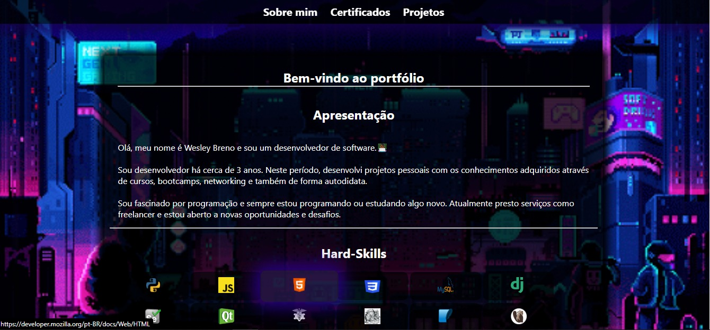

<h1 align="center">Portfólio</h1>

 

Clique aqui para acessar o <a href="https://wesley-breno.github.io/Portfolio/" target="_blank">portfólio</a>.

<h2 align="center">Resumo</h2>

  Este é meu portfólio que apresenta meus projetos mais importantes, destacando minhas habilidades técnicas. Além disso, você pode conhecer um pouco sobre mim e entrar 
  em contato através das minhas redes sociais. Portfólio sempre sendo atualizado e refatorado para uma melhor apresentação e destaque dos meus trabalhos mais recentes e 
  relevantes.

<h2 align="center">Tecnologias usadas</h2>

  
  

